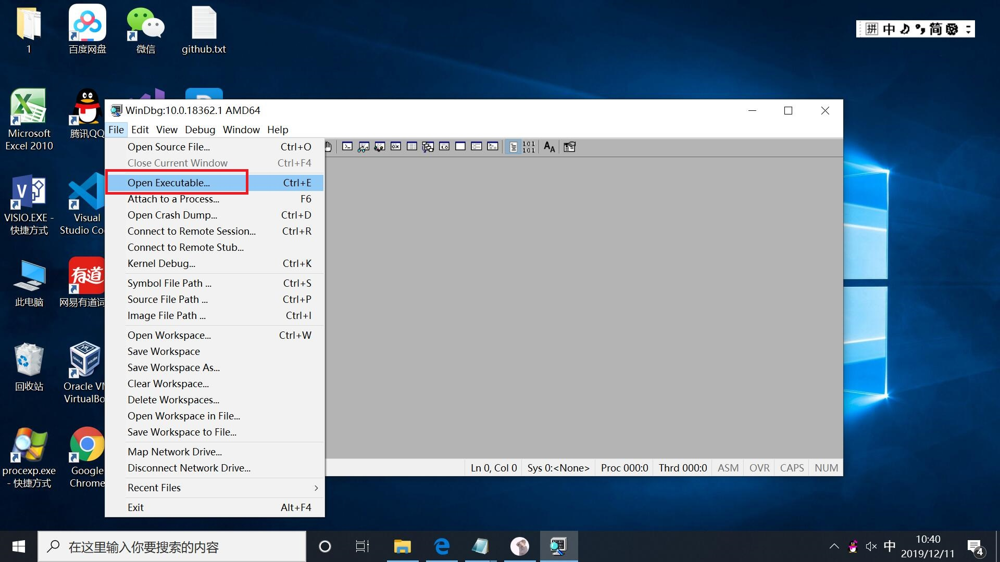
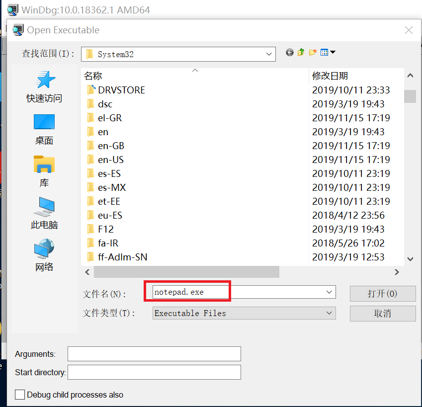
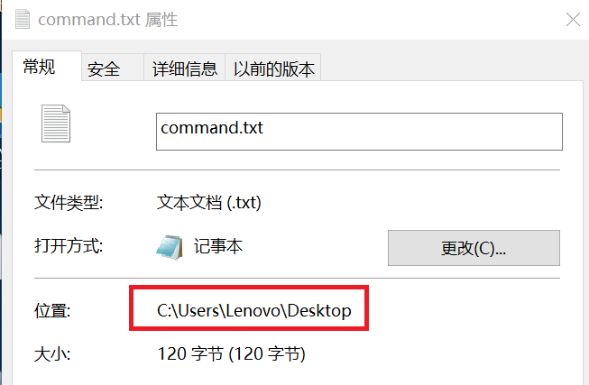
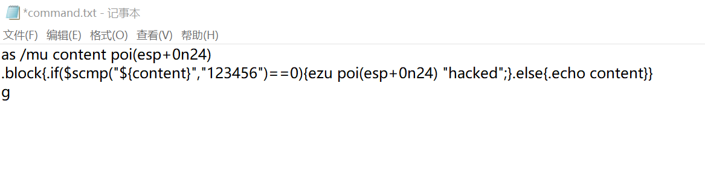
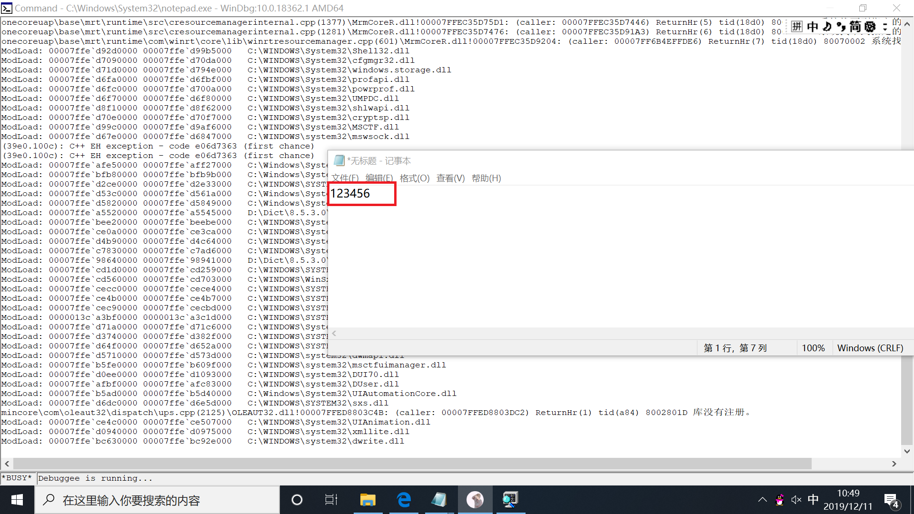
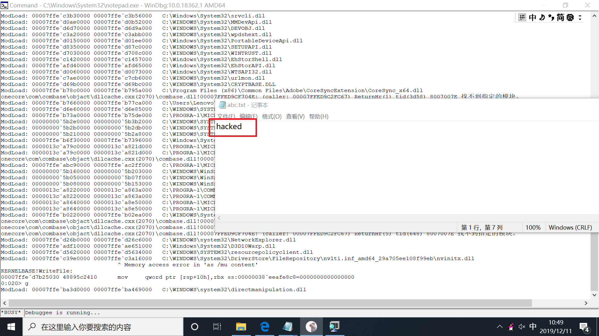

# WinDbg实验报告

## 实验要求

* 利用windbg，在txt文件中输入"123456"后会将其改变为"hacked"

## 实验过程

1. 打开64位windbg,点击文件，选择可执行文件


2. 根据notepad所在路径打开记事本


3. 在WinDbg中设置断点，输入

```bash
bu kernelbase!writefile "$$><C:\\Users\\Lenovo\\Desktop\\command.txt"，
```

其中command.txt存放在计算机的桌面上，command.txt的内容如下：



4. 在WinDbg输入g，可以看到弹出notepad新窗口，我们在这个窗口中输入"123456"


5. 保存后我们刚刚输入的数据变为了"hacked"，实验成功



## 实验分析

1. ```poi(esp+0n24)```  是一种unicode编码的内容，它的别名为content

2. ```.if($scmp("${content}","123456")==0){ezu poi(esp+0n24) "hacked";}```
如果内容为123456，就将它改为hacked。其中ezu后面要加上需要改的目标和要改的内容。

3. ```.else{.echo content}```
如果输入的内容不为123456就输出内容

## 实验遇到的问题

1. WinDbg和要调试的程序必须对应，我的notepad是64位，那么WinDbg也需要使用64位的，否则有可能遇到一些意想不到的问题。
2. 一开始设置断点之后，再输入bl一直无法显示断点信息。后来经过很久后自行显示，推测可能是因为程序去下载字符集导致无法显示。
