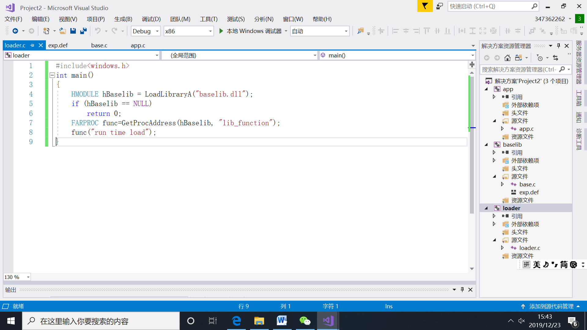
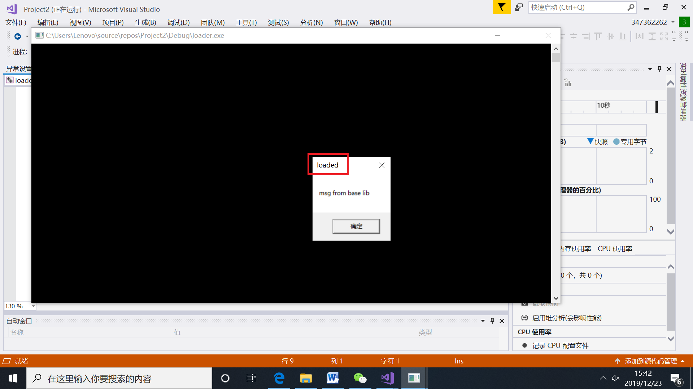
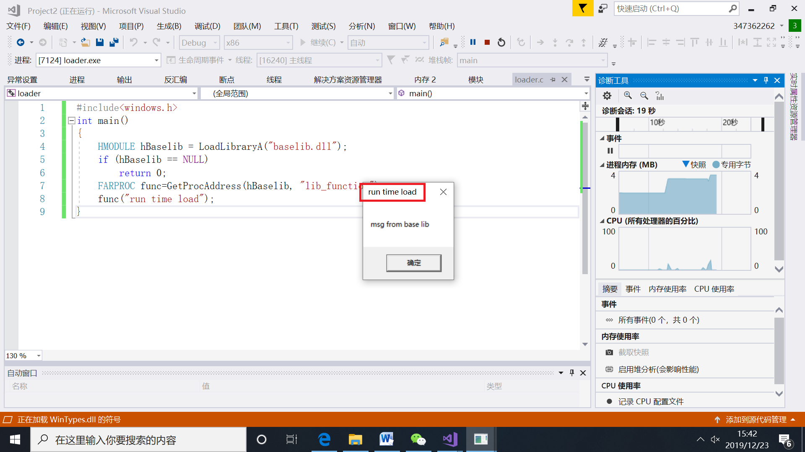
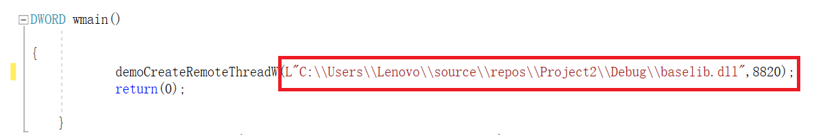
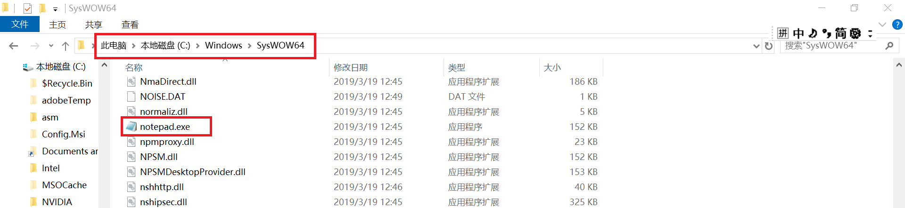
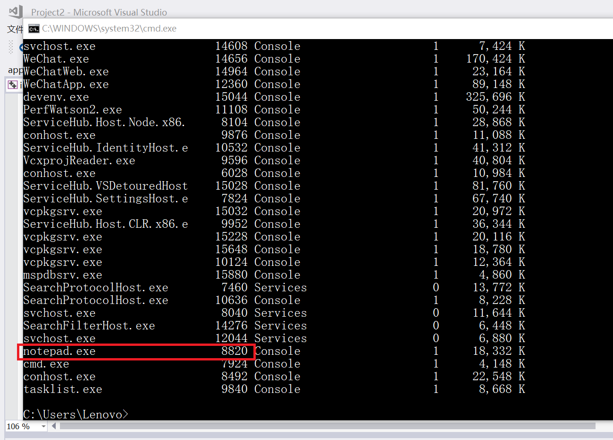
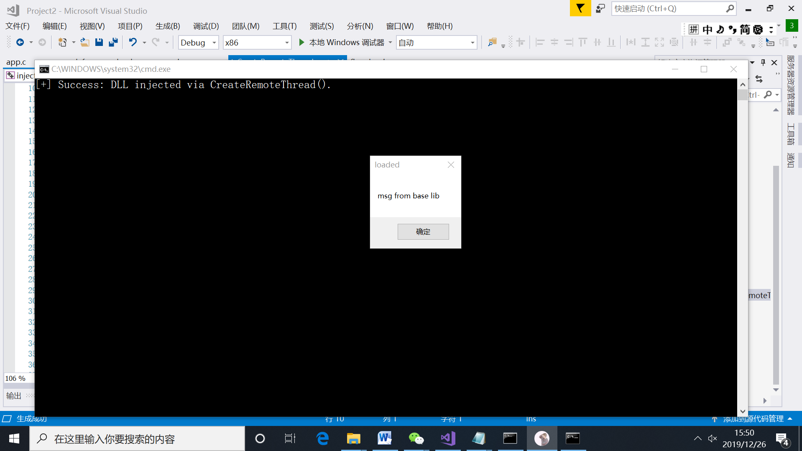

# dll inject课堂实验复现

## 一、runtime load

1. 新建项目loader，在[loader.c](Project2/loader/loader.c)中写入代码

2. 开始运行，发现有两次弹窗。

* 一次是"loaded"，这是生成dll的代码base.c中，DllMain调用时传入的参数"loaded"

* 第二次弹窗是[loader.c](Project2/loader/loader.c)中传入的参数"run time load"

## 二、dll inject

1. 新建项目inject，参考[injectAllTheThings](https://github.com/fdiskyou/injectAllTheThings)，添加源文件[t_CreateRemoteThread.c](Project2/inject/t_CreateRemoteThread.c)和头文件[fheaders.h](Project2/inject/fheaders.h)

2. 主函数调用函数demoCreateRemoteThreadW，传入两个参数。第一个参数是我们自己编写并生成的dll的地址，第二个参数是我们想要注入的进程的PID。这里我们选择对记事本进行注入。

* 注意dll的路径要填绝对路径。因为是notepad.exe加载dll，所以需要让notepad.exe找到我们编写的恶意dll。一开始我写成了相对路径，这是不正确的。
* 要对路径进行转义，否则有可能无法正确加载。

3. 找到**32位**的记事本程序，它位于C:\Windows\SysWOW64下。双击打开，同时在命令行中输入tasklist找到notepad的PID，可以看到是8820.那么我们代码中的第二个参数就应该是8820

4. 运行程序，出现弹窗，这就是我们dll中会出现的MessageBox弹窗。证明我们的dll注入成功

## 实验总结

* dll inject，会让一个已经编写完毕的成熟的软件，通过加载一个动态链接库，实现修改这个软件的行为。即，黑客写一个恶意dll，让受害者加载。 
* 程序运行时，先看当前目录下有无dll，若无，就会去去系统目录下看有无dll。黑客可以在IE浏览器目录下写一个kernel32.dll,IE浏览器运行时就会加载这个恶意dll。恶意dll有可能会对全盘文件加密，从而实现勒索。
