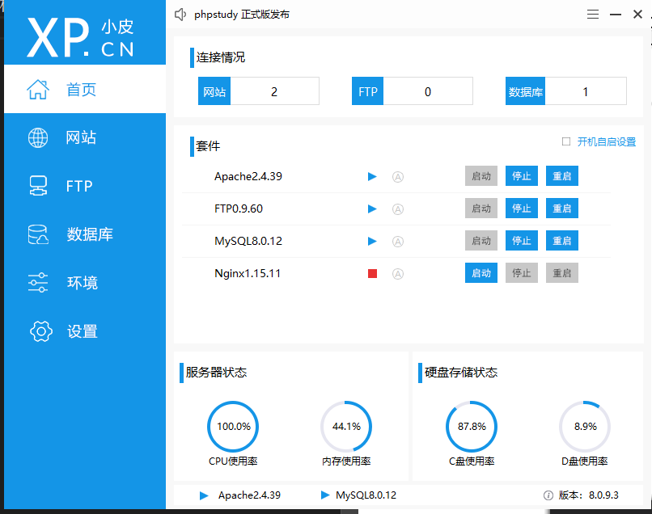
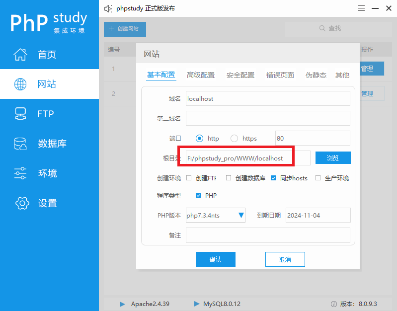
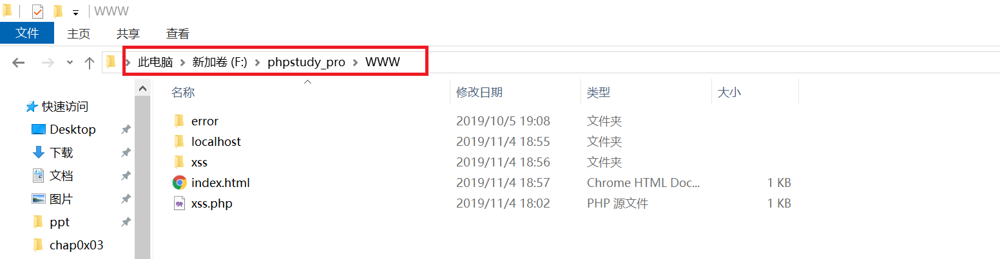
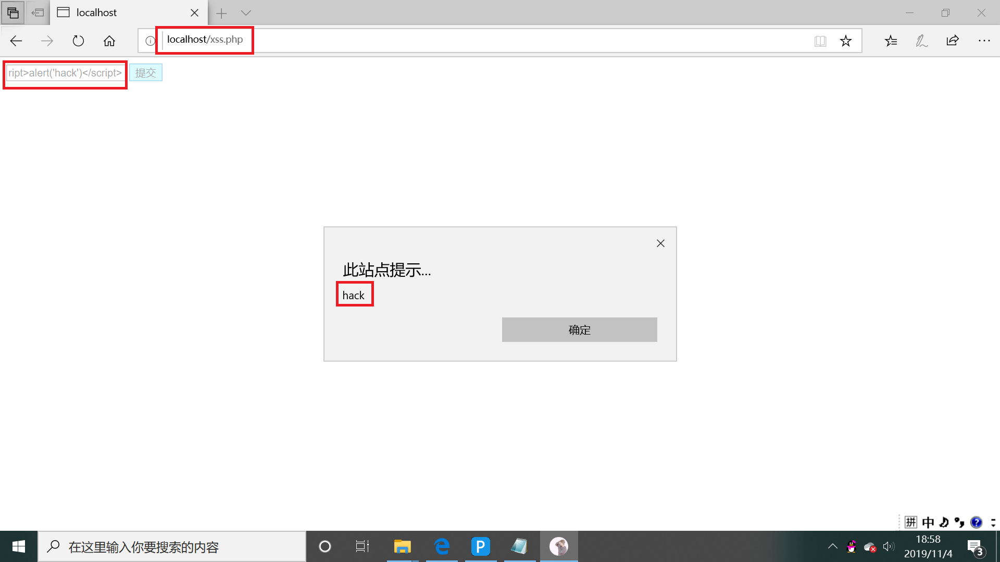

# 跨站脚本攻击实验

1. 安装php，我选择安装了phpstudy，这样配置比较容易，安装后的界面如图



2. 编写xss跨站脚本攻击代码，代码分为前端(index.html)和后端(xss.php)。自己制作的网页中有一个文本框，可以用来提交内容。如果有用户提交恶意脚本，则浏览器会执行脚本。   


3. 在phpstudy创建网页时会有一个路径，要记下来后面需要使用



4. 将自己写好的代码复制到刚才记下的路径下



5. 在浏览器输入http://localhost/xss.php，可以弹出我们自己制作的网页，在文本框中输入
``` 
   <script>alert('hack')</script>
```
并点击提交，可以看到弹出窗口，实现跨站脚本攻击。


# 知识梳理

* 原生应用程序安全：内存相关
   * 显式声明：malloc，直接指明内存
   * 隐式声明：局部变量
   * 尽量不要使用全局变量，因为全局变量在整个程序的生命周期都占用内存
* web应用程序安全：逻辑问题
   * xss跨站脚本攻击：程序员未考虑到用户输入恶意代码的可能性

