# 动态链接实验报告

## 实验步骤

### 一、loadtime

1. 文件的目录结构如图，工程app下有文件app.c；工程baselib下有文件base.c和exp.def
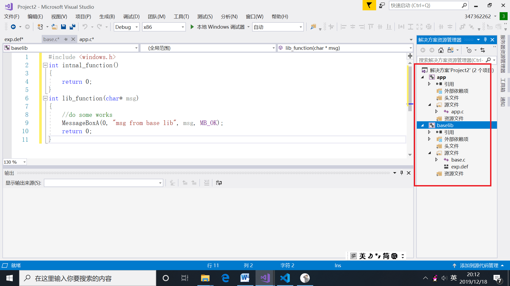
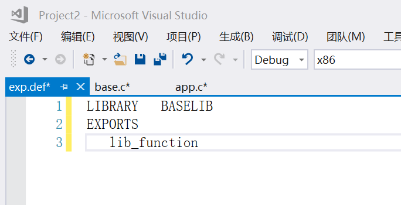
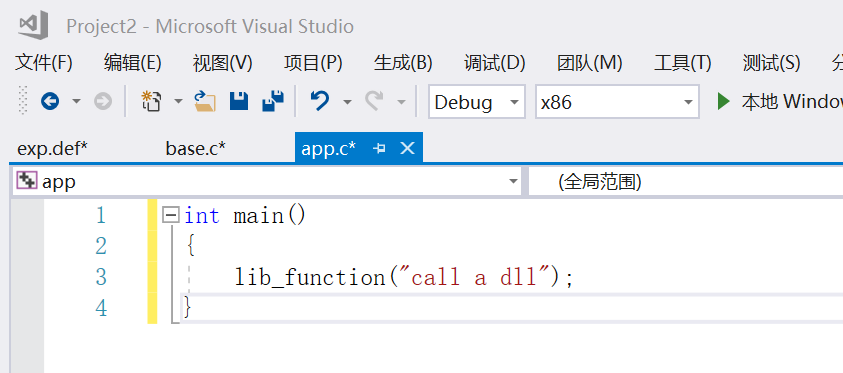

2. 进入base.c所在目录，对base.c进行编译生成base.obj
    * 命令：cl.exe /c base.c
3. 对base.obj进行链接
    * link base.obj User32.lib /dll /def:exp.def
    * 链接后生成三个文件：base.exp、base.lib和BASELIB.dll

4. 进入app.c所在目录，对app.c进行编译
    * 编译后生成app.obj文件 
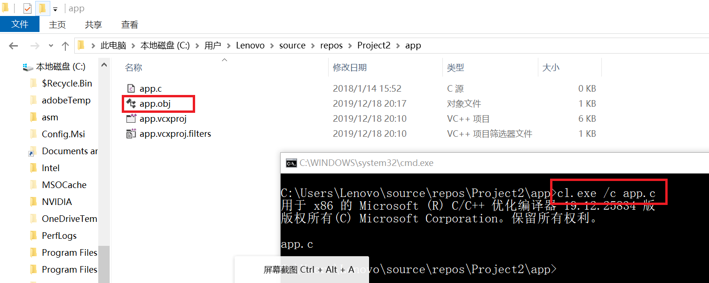
5. 对app.obj进行链接。
    * link app.obj ..\baselib\base.lib /out:app.exe
    * 生成app.exe文件
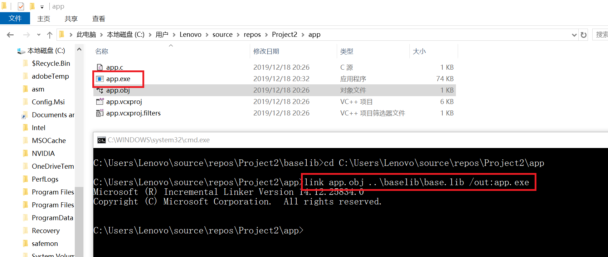   
6. 此时直接运行app.exe会报错，找不到BASELIB.dll文件
    * 报错
     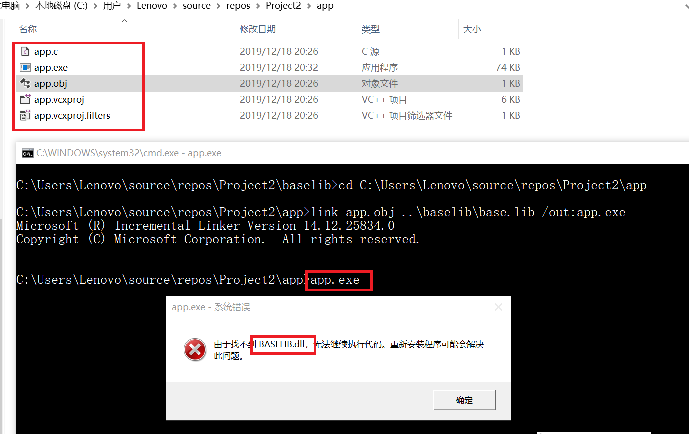 
7. 将第3步中生成的VASELIB.dll文件拷贝到app.exe文件目录下，再次运行app.exe，成功运行
    * 成功运行，出现弹窗
     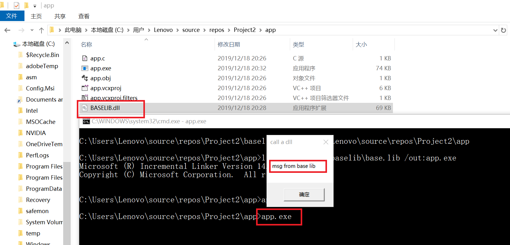

### 二、run time

* 示例代码使用LoadLibrary函数获得Myputs DLL的句柄。如果LoadLibrary成功，程序将使用GetProcAddress函数中返回的句柄来获取DLL的myPuts函数的地址。调用DLL函数后，程序调用FreeLibrary函数卸载DLL。

1. 根据老师给出的[参考链接](https://docs.microsoft.com/zh-cn/windows/win32/dlls/using-run-time-dynamic-linking)，将示例代码复制下来，并将其中调用的dll改为我们第一步中生成的BASELIB.dll
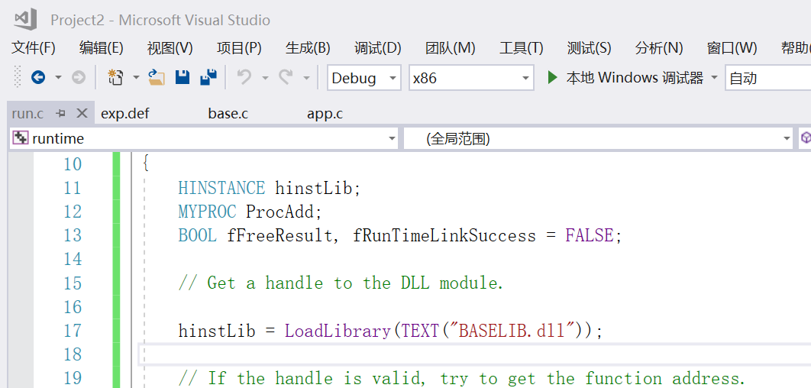

2. 将我们第一步生成的BASELIB.dll复制到run.c的目录下

3. 打开visual studio命令提示，进入run.c的目录，并对run.c进行编译，生成run.obj。
    * cl.exe /c run.c
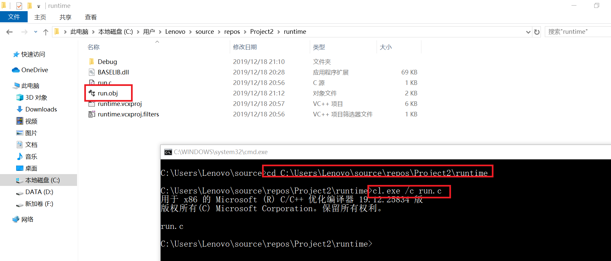

4. 对run.obj进行链接，因为程序使用运行时动态链接，所以没有必要将模块与DLL的导入库链接起来。链接后生成run.exe
     * link run.obj
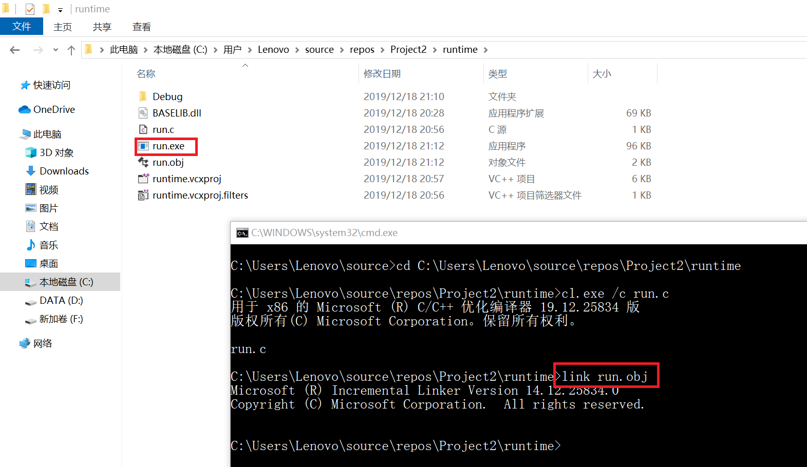
5. 执行run.exe
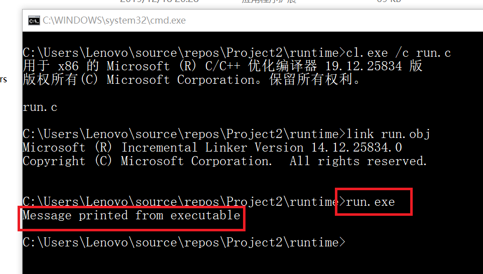

* 这个例子说明了运行时和加载时动态链接之间的一个重要区别。如果DLL不可用，则使用加载时动态链接的应用程序必须终止。但是，运行时动态链接示例可以响应错误。
