# 动态链接库实验报告

## 实验过程

### 一、Taking a Snapshot and Viewing Processes

1. 将[Taking a Snapshot and Viewing Processes](https://docs.microsoft.com/zh-cn/windows/win32/toolhelp/taking-a-snapshot-and-viewing-processes)中给出的实例代码复制到新建工程项目中。
2. 为了使代码能成功运行，需要加上头文件#include<stdio.h>，同时要将.cpp文件修改为.c文件。这是因为.c文件和.cpp文件所使用的编译器不同，一般情况下建议使用.c文件。
3. 将程序进行修改后运行，(详情见源文件all_processes.c)同时打开我们的任务管理器，点击详细信息，可以看到两者的内容几乎完全相同。
打开cmd，输入命令tasklist，可以看到输出的内容和all_process.c运行结果以及任务管理器中的结果相同。
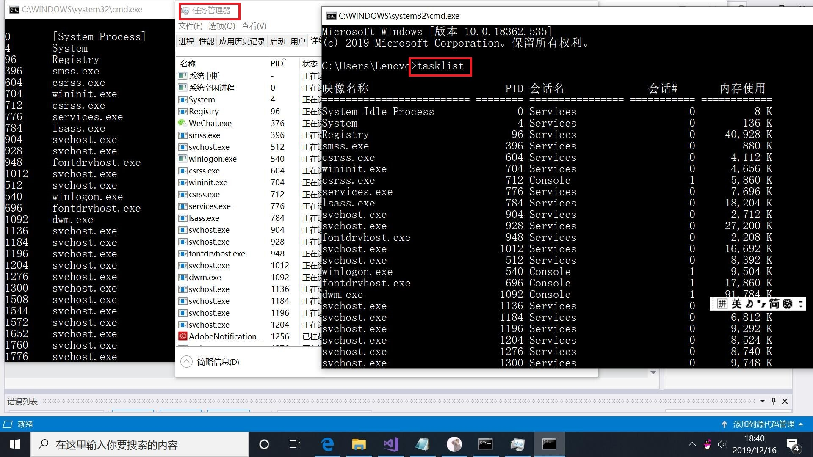

### 二、动态链接库

1. a.c和b.c的内容如下：
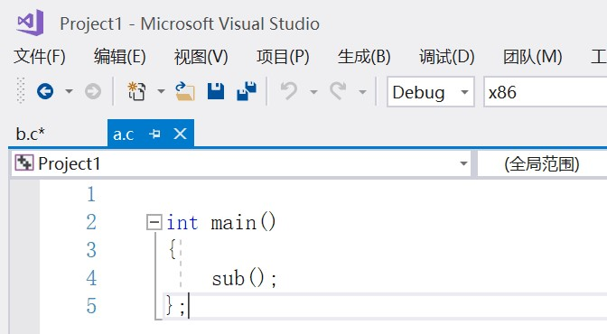
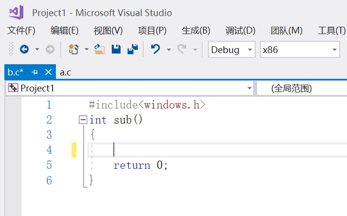

2. 在VS中选择工具->Visual Studio命令提示，弹出命令行对话框
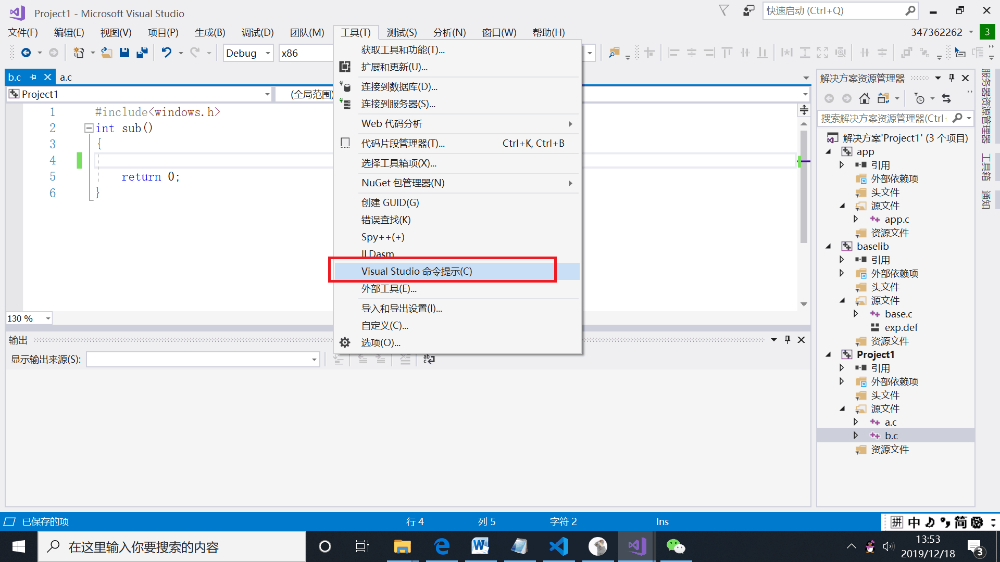

3. 进入a.c和b.c所在的路径下，并用cl.exe对a.c和b.c进行编译，编译后生成a.obj和b.obj
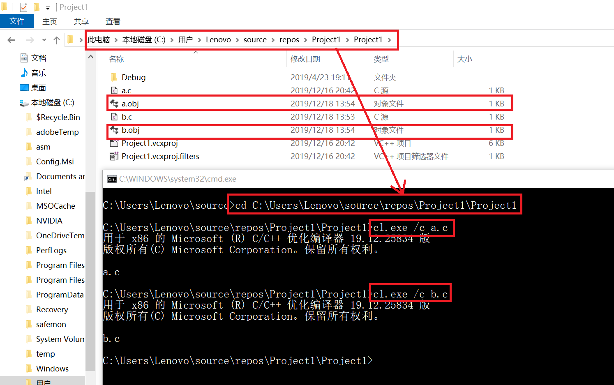

4. 对a.obj和b.obj进行链接，生成haha.exe
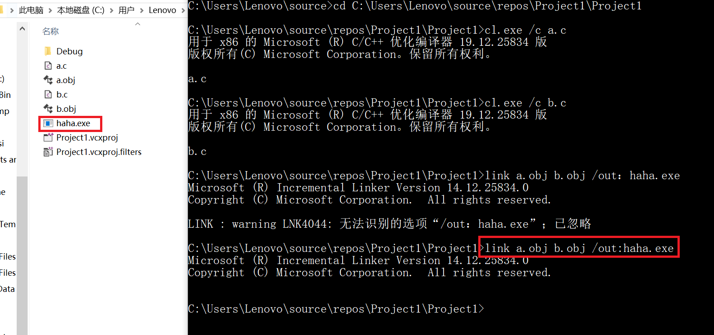

5. 修改b.c文件，添加```MessageBox(0, "msg", 0, 0);```
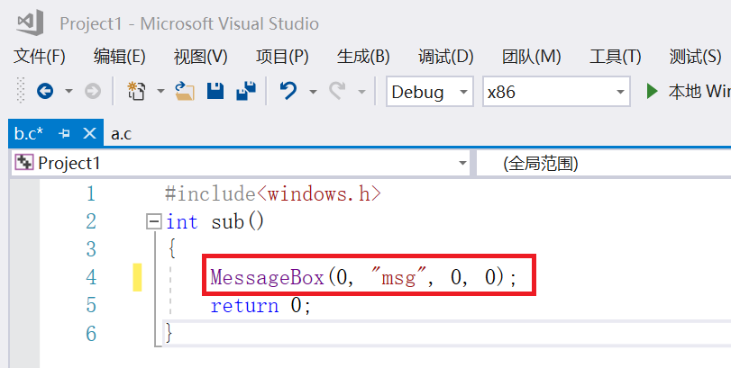

6. 重新对b.c进行编译。编译后用刚才的link命令生成hehe.exe发现会报错。在link时加上我们需要的库User32.dll，这时可以成功生成hehe.exe。
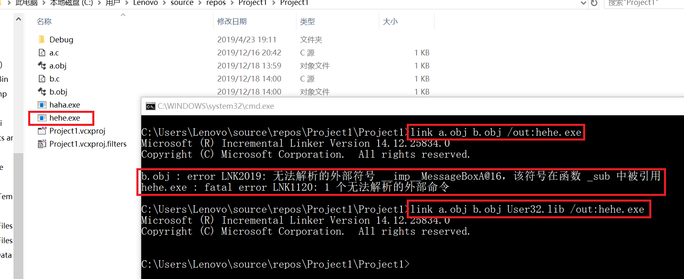
输入```hehe.exe```程序执行，弹出对话框。
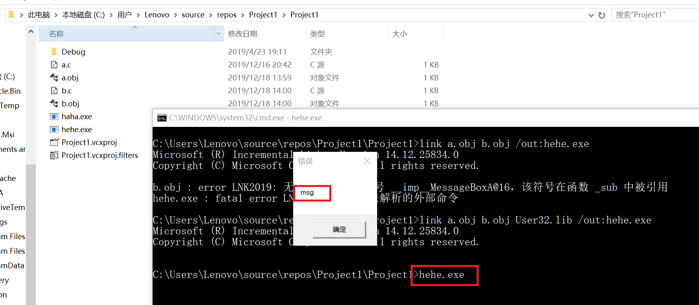

7. 利用dumpbin分别查看haha.exe和hehe.exe的库
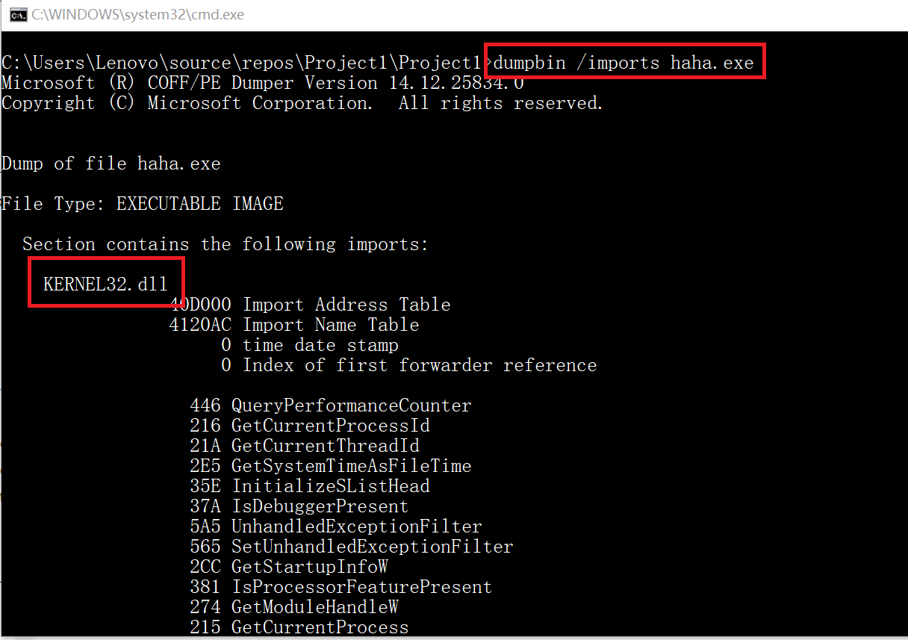
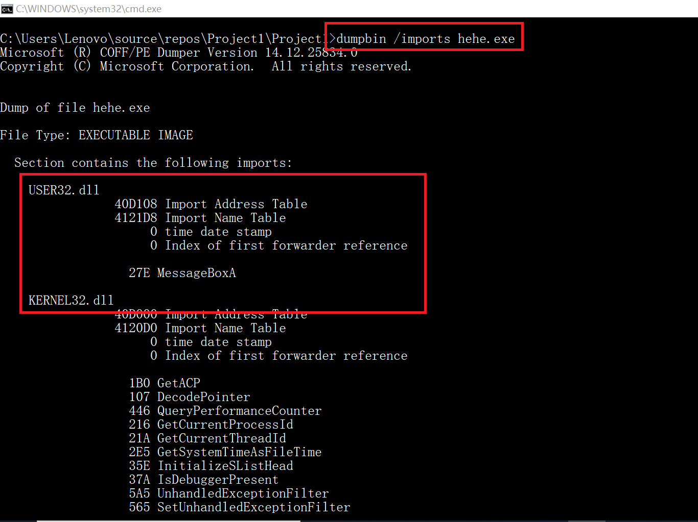
可以发现hehe.exe比haha.exe多出USER32.DLL这一部分，也就是我们刚才在链接生成haha.exe时加的库

### 三、利用工具观察可执行程序的动态链接库

1. 使用dependency分别查看haha.exe和hehe.exe的动态链接库调用关系，这和刚才用dumpbin观察到的结果相同。

* haha.exe调用的库为KERNEL32.DLL
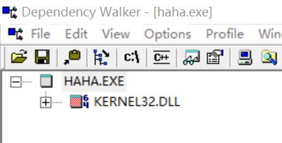
* hehe.exe调用的库为KERNEL32.DLL和USER32.DLL
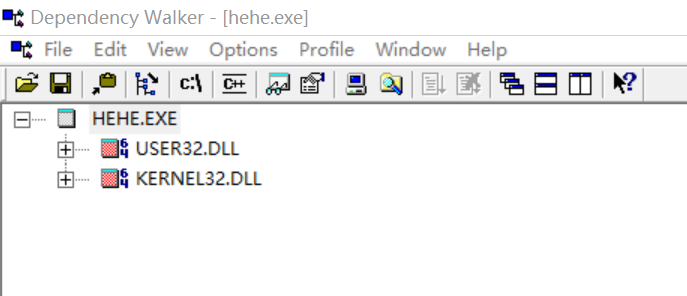

2. 展开可以看到KERNEL32.DLL和USER32.DLL还调用了其他的库，他们之间形成了树形结构
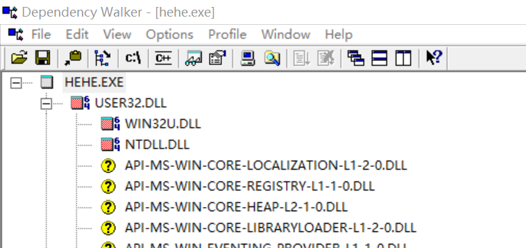
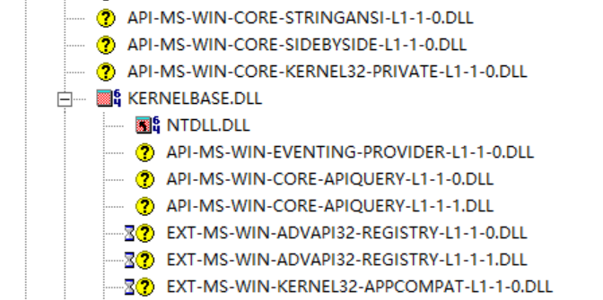
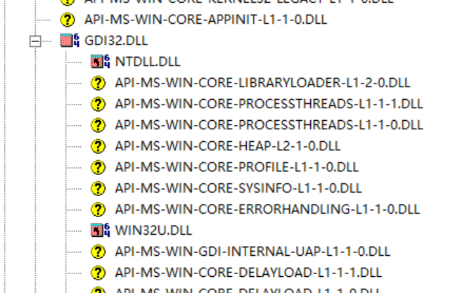

3. 画出部分库的调用关系的示意图如下：
* haha.exe
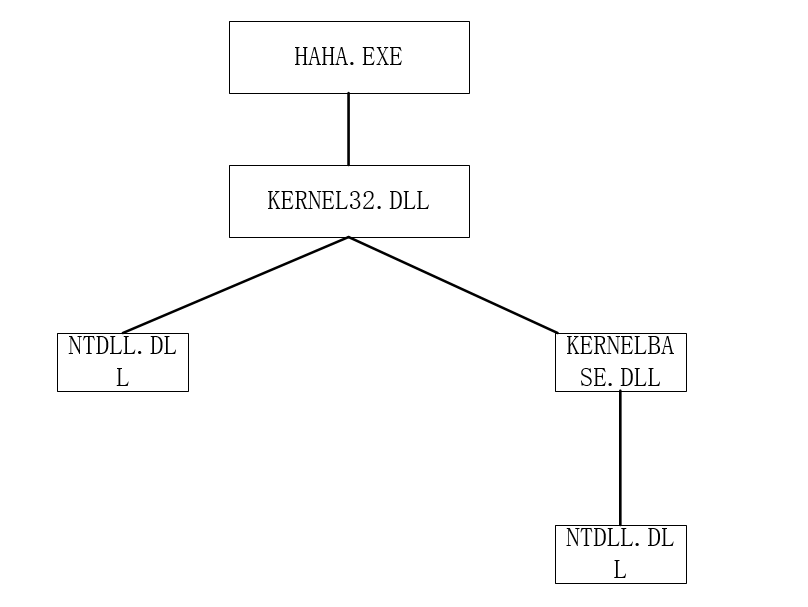
* hehe.exe
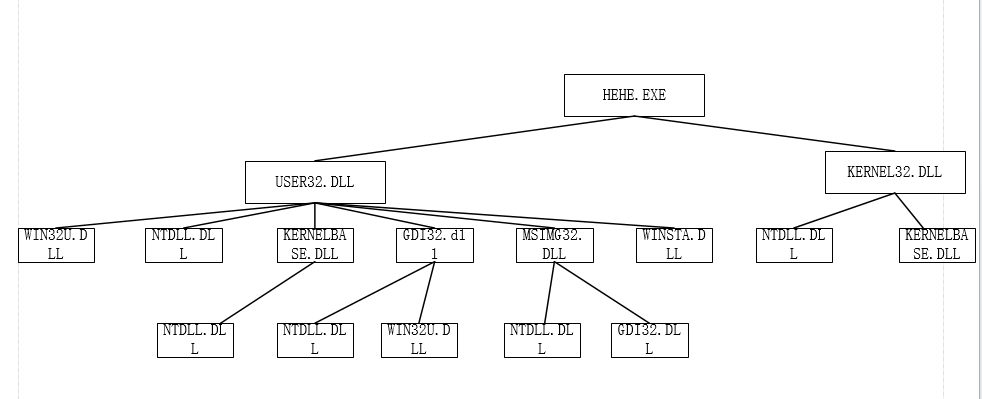

4. 打开Process Explorer，点击view->Lower Pane View->DLLs
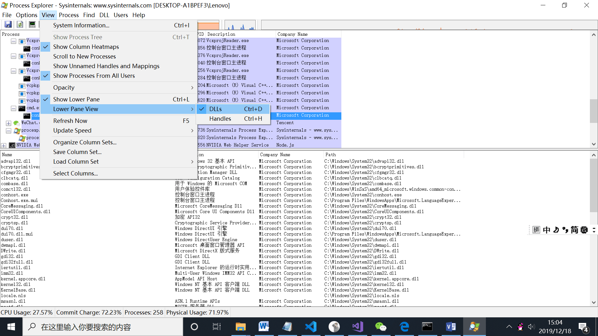

5. 运行hehe.exe后可以看到Process Explorer进程列表中出现hehe.exe，选中查看它调用的库，可以看到KERNEL32.DLL和USER32.DLL以及他们所调用的其他的库。
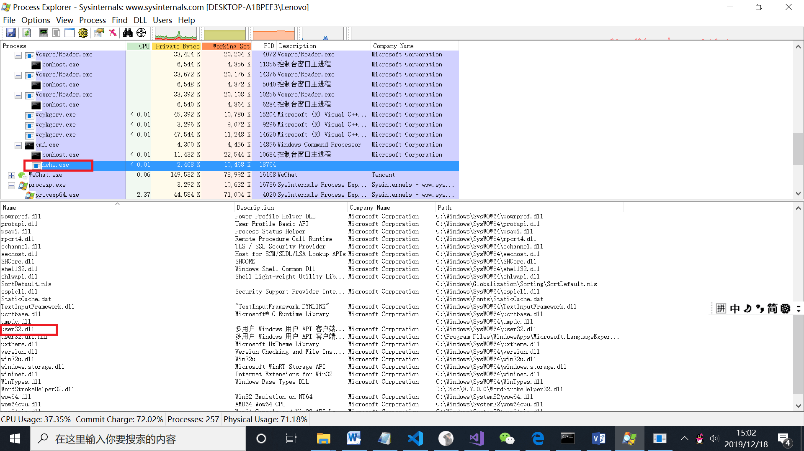
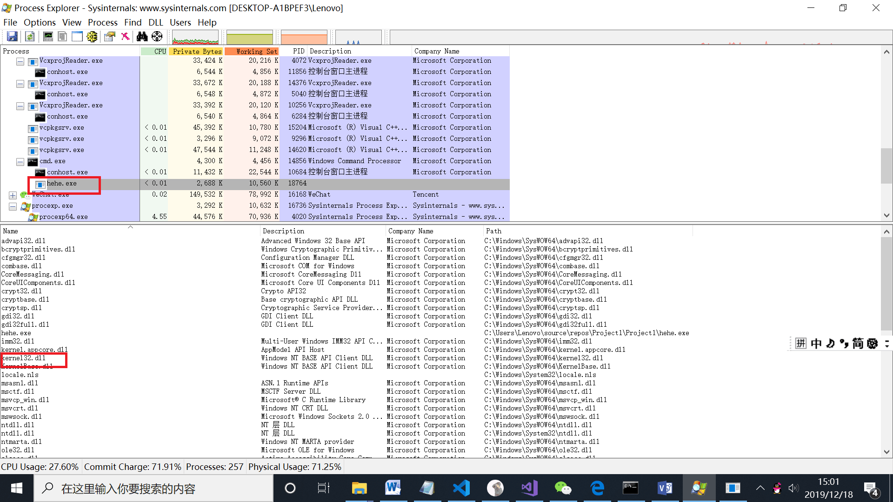

## 实验总结

* 静态链接和动态链接两者最大的区别就在于链接的时机不一样，静态链接是在形成可执行程序前，而动态链接的进行则是在程序执行时
  * 在我们的实际开发中，不可能将所有代码放在一个源文件中，所以会出现多个源文件，而且多个源文件之间不是独立的，而会存在多种依赖关系，如一个源文件可能要调用另一个源文件中定义的函数，但是每个源文件都是独立编译的，即每个*.c文件会形成一个*.o文件，为了满足前面说的依赖关系，则需要将这些源文件产生的目标文件进行链接，从而形成一个可以执行的程序。这个链接的过程就是静态链接
  * 动态链接的基本思想是把程序按照模块拆分成各个相对独立部分，在程序运行时才将它们链接在一起形成一个完整的程序，而不是像静态链接一样把所有程序模块都链接成一个单独的可执行文件。
  
  * 自己写的代码通常是静态链接方式，系统API通常是动态链接方式。

* 导出表：两个程序在拼接的时候需要的数据，使两个程序可以拼接完成。
每一个程序里面都有printf，很浪费空间，程序会很臃肿；若发现printf中有bug，必须将所有调用printf的exe都进行修改。若放入模块中，只需要将模块中的代码修改即可。如果不希望将代码公开，可以直接给出dll文件，dll是可执行文件，可以使闭源文件也可以被调用。保证基础代码只有一个拷贝就够了。新编写的代码只是基础代码的增量。靠我们在可执行文件中的导出表和导入表来执行。

