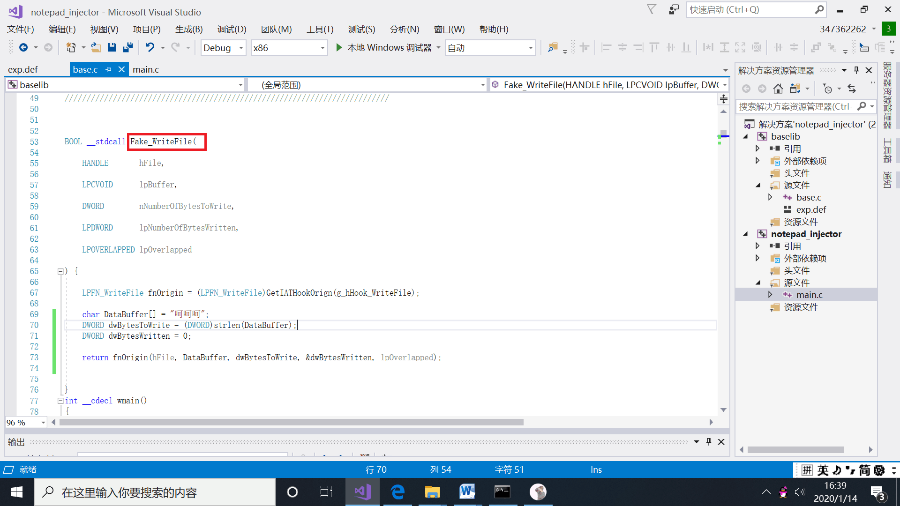
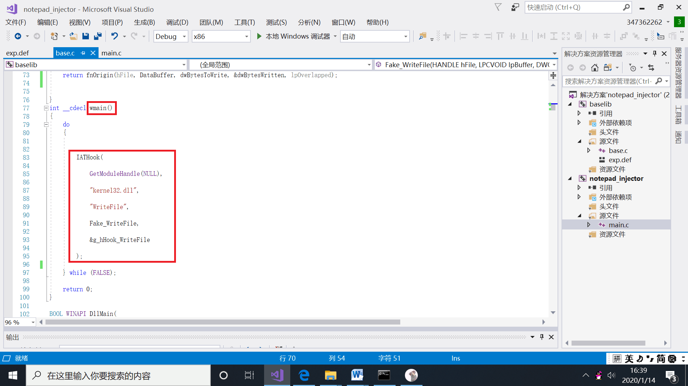
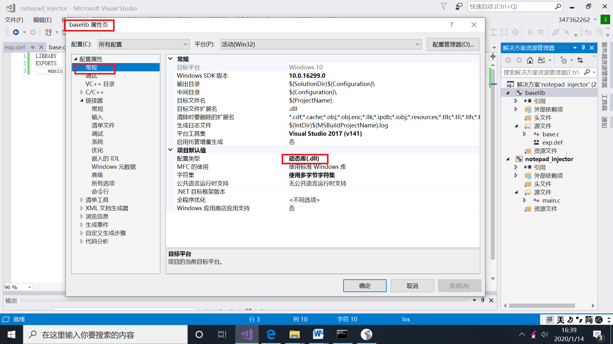
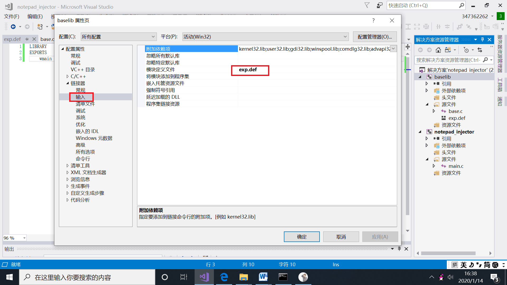
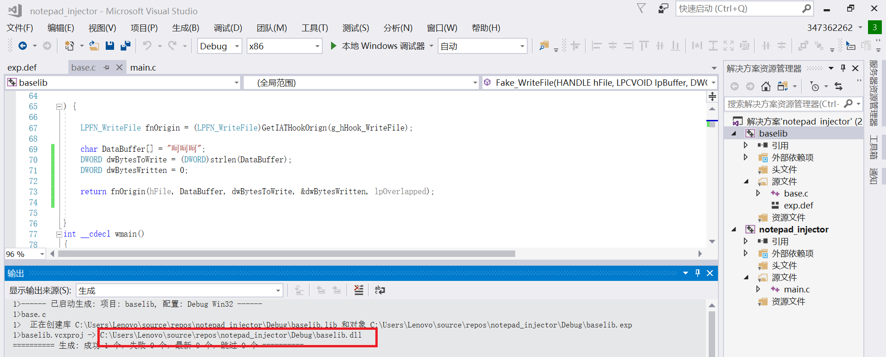
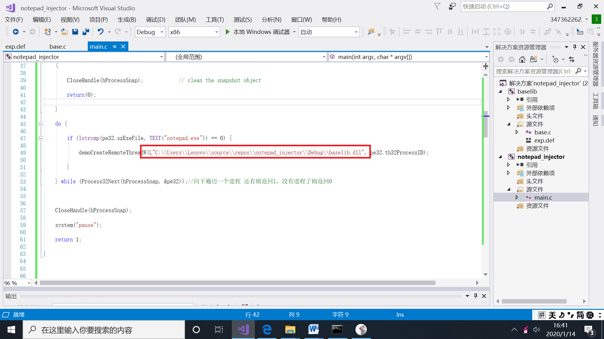
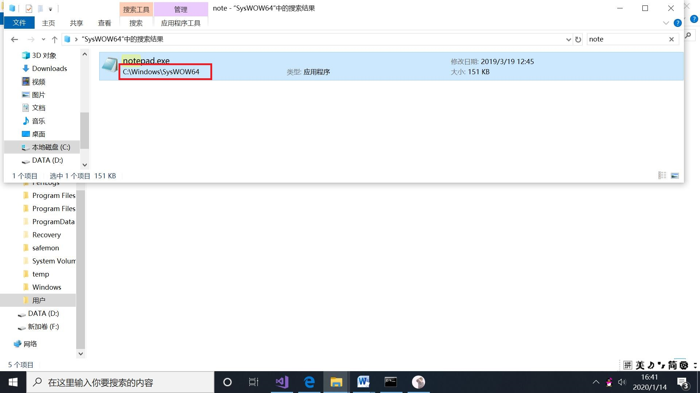
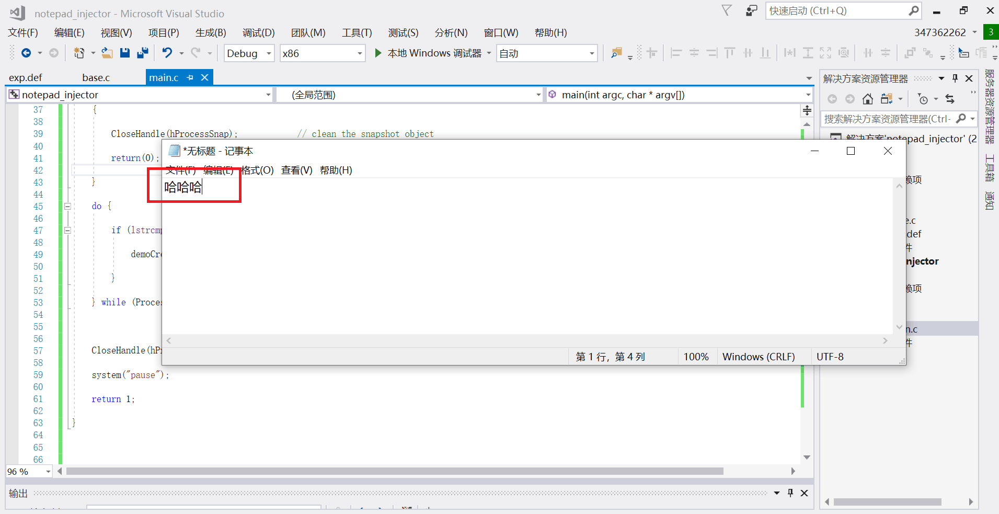
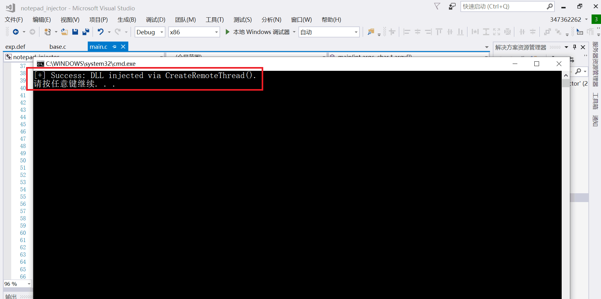
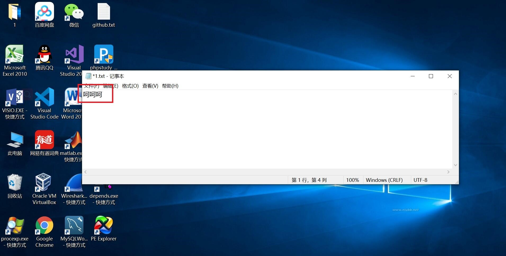

# 大作业-实现对记事本的注入

## 实验要求

每次使用记事本写txt文件时，如果写的是"哈哈哈"，就改为"呵呵呵"。把这个文件写为dll，用和示例代码相同的方法注入到notepad进程中，进行hook，并且验证是否成功，即能否完成篡改内容的功能。

## 实验过程

1. 根据示例代码中假的MessageBoxA，编写假的writefile函数，即 Fake_WriteFile，函数可以实现将我们写入记事本的内容改为呵呵呵


2. 按照示例代码逻辑编写我们的wamin函数。对于我们想注入的程序notepad，它调用writefile函数时，实际执行的是我们写的假的writefile函数。


3. 对base.c进行属性设置。
```bash
常规->配置类型->动态库
```
* 
```bash
链接器->输入->模块定义文件->exp.def
```
* 

4. 设置完成后右键项目baselib生成，会在路径"C:\Users\Lenovo\source\repos\notepad_injector\Debug"下生成动态库baselib.dll


5. 根据示例代码修改一下，demoCreateRemoteThreadW函数的第一个参数是刚才生成的动态链接库的绝对路径。注意一定是绝对路径，这样notepad.exe才能找到这个dll，去加载它。同时前面加上L，且中间用"\\"分隔，进行转义。

6. 找到32位的notepad程序，它在路径"C:\Windows\SysWOW64"下


7. 双击打开，写入"哈哈哈"并保存在桌面上


8. 执行main.c，显示成功后，打开刚才保存的1.txt文件，发现内容改为"呵呵呵"。实验达到预期结果。



## 实验总结

* IAT就是导入地址表，相当于信箱。信箱的位置是固定的，但它其中的内容在不停地变化。黑客可以编写程序解构PE文件，从而找到系统函数保存的地址。这个地址谁都可以写入。黑客将真实的MessageBox地址改为自己写的假的地址。运行时不会对地址真假进行检查，而是会直接call 这个地址，那么程序就会运行到黑客写的假函数里面。IAT hook就是替换掉原本存的真的系统函数的地址，程序运行时调用的是假的函数的地址，从而运行到假的函数中去。


## 参考文献

* [injectAllTheThings](https://github.com/fdiskyou/injectAllTheThings)

* [IATHook](https://github.com/tinysec/iathook)
