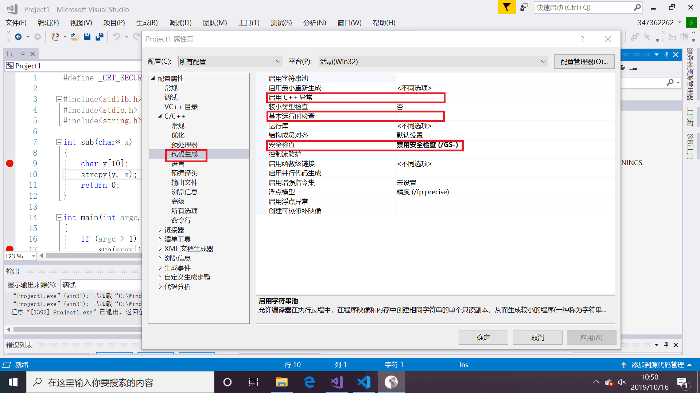
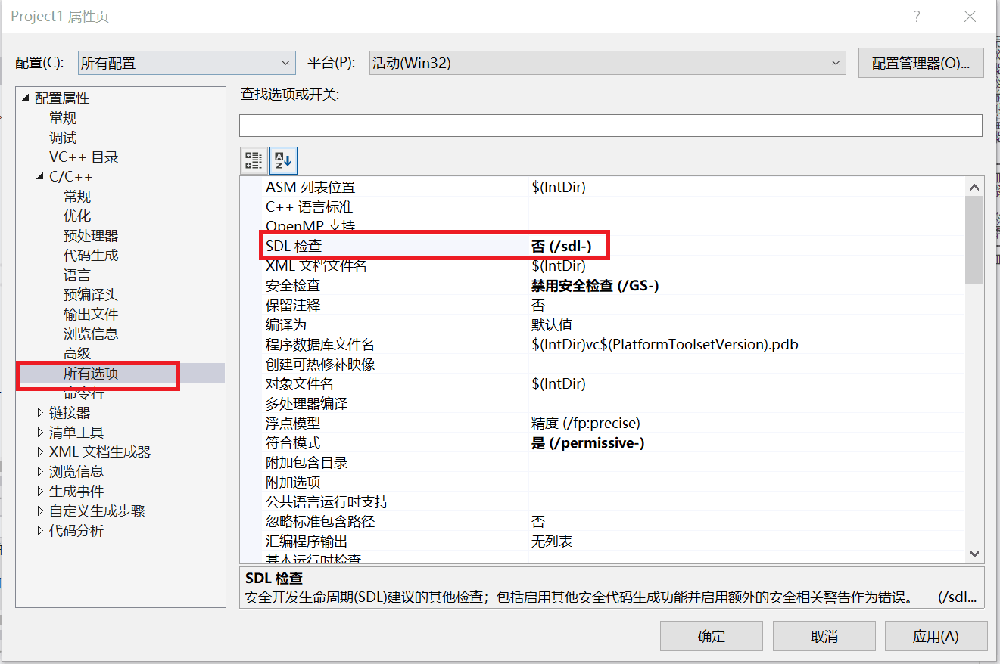
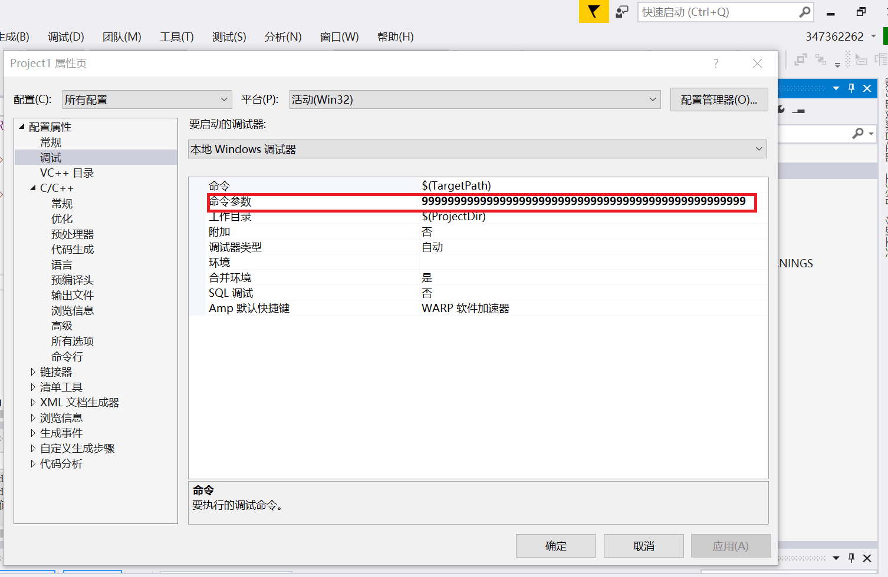
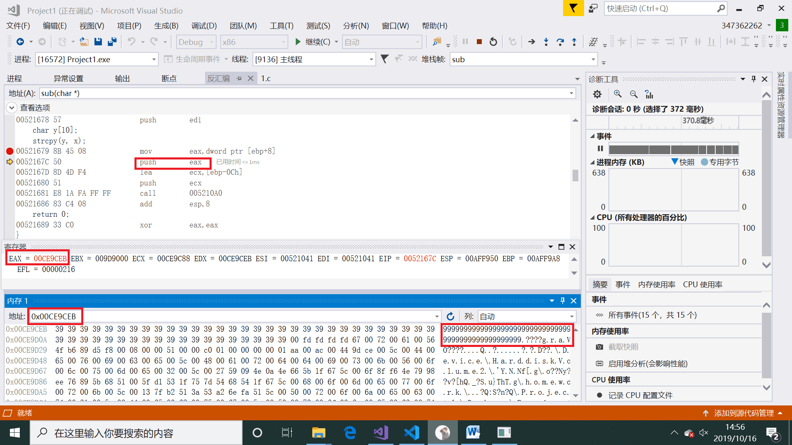
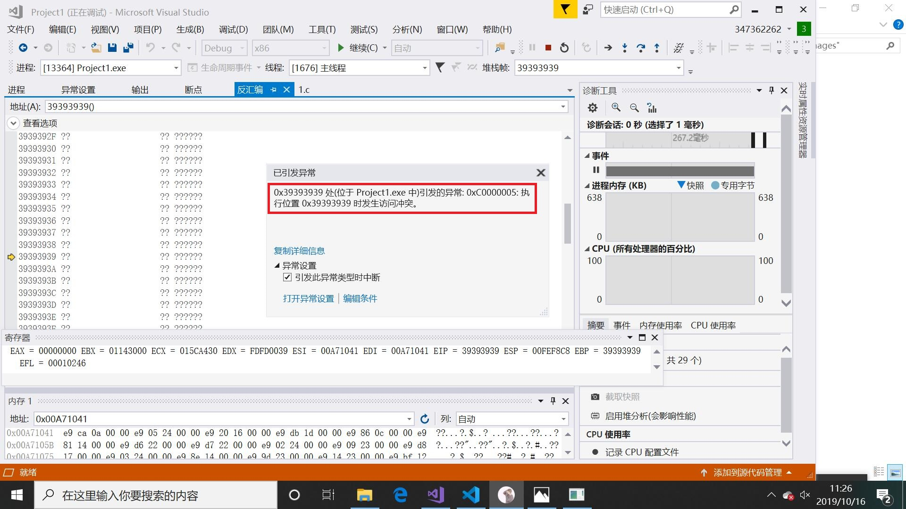
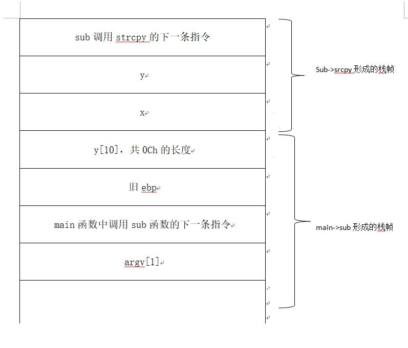

# 缓冲区溢出实验报告
---

## 实验环境

1. 在Visual studio中进行设置，右键项目，选择属性。如图所示，将启用C++异常和基本运行时检查删除，安全检查中选择禁用安全检查，并将SDL检查设置为否

2. 在调试中，将命令参数一栏输入999999999999999999999999999999999

3. 分别在主函数和子函数中设置两个断点，方便我们调试。

4. 开启调试后，右键选择转到反汇编，并且选择不显示符号名。

5. 点击逐语句开始进行逐句执行

## 实验过程

### 对反汇编的分析

1. push ebp
在sub子函数中，先将旧的ebp即主调函数的ebp入栈。这样做的理由是，一旦子函数sub执行结束回到主函数之后，可以通过主函数的ebp定位主函数的局部变量和参数，使程序继续执行。

2. mov ebp,esp
将当前栈顶指针esp的值赋给ebp，这里新的ebp就是sub子函数的ebp

3. sub esp,4Ch
为局部变量开辟长度为4Ch的空间

4. 接着将一些函数会用到的寄存器一一push入栈

5. mov         eax,dword ptr [ebp+8]  
   push        eax  
   lea         ecx,[ebp-0Ch]  
   push        ecx 
eax=ebp+8=999999999999999999999，即刚才输入的参数
ecx=ebp-0C是局部变量
在寄存器中看到此时寄存器EAX的值为0x00CE9CEB，在内存中输入EAX，可以看到就是刚才输入的参数9999999999999999999999999999

6. call指令调用strcpy函数

7. 结束后一点点回退栈。在strcpy函数返回时是不会报错的，但在sub函数回退过程中，由于我们输入的参数长度过长，大于了数组y的长度，所以数据溢出，覆盖掉了main中调用sub函数的下一条指令，所以返回到的位置显示为0x39393939报错。

## 实验总结

* EIP表示当前指令执行到哪一步
ESP存放的是栈顶指针
EBP用来定位局部变量和参数，每进行一次函数调用就改变一次

* 一个栈帧由以下几个部分构成
  * 参数入栈
  * 下一跳指令入栈，即返回地址
  * 主调函数（caller）的栈基址
  * 局部变量

* 本次实验的栈结构如图所示

